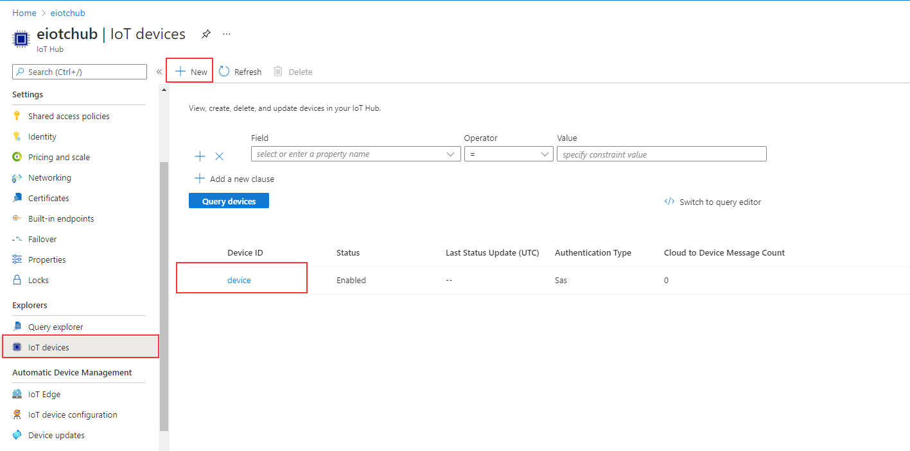
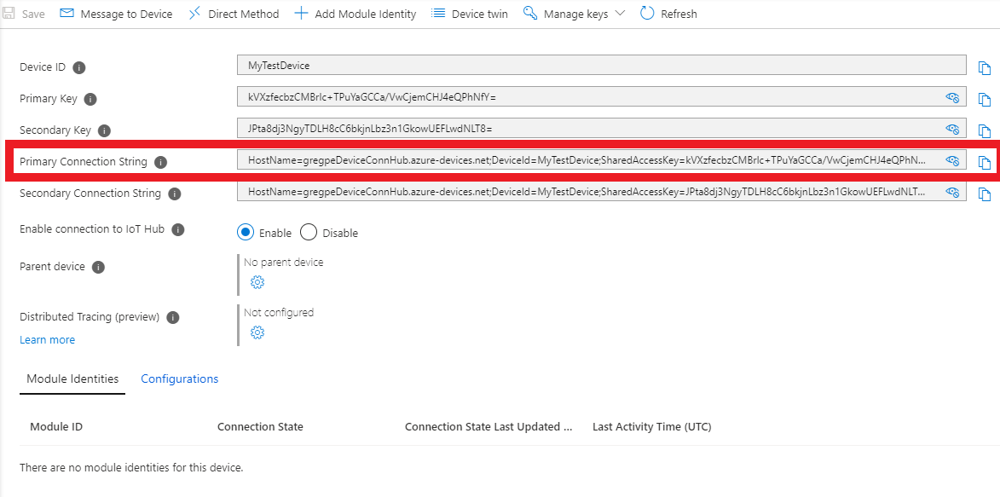

# Deploy and Connect Devices

## 1. Step by step deployment

### Preparation

1. Clone this repository `git clone https://bitbucket.org/enocean-cloud/iotconnector-docs.git` or [download](./downloads.md) the repository files. This should be downloaded to a directory in which you have edit and execute files rights.

2. Prepare your certificate. If do not have one, you can [generate a self-signed certificate](./additional-notes.md#generating-self-signed-certificates), in this case prepare the`"myCA.pem"` file for the Aruba AP.

3. Prepare the `*.crt` and `*.key` file from your CA for the NGINX proxy. If you do not have one, you can [generate a self-signed certificate](./additional-notes.md#generating-self-signed-certificates).

4. Find and note the EnOcean ID - EURID (32bit e.g. 04 5F 69 4E) and [EEP](./index.md#supported-enocean-equipment-profiles-eep) (e.g. D2-14-41) of the EnOcean sub-gigahertz enabled devices you like to use with the IoTC.

    This information is available:

    - On the product label - in text and QR code format
    - In NFC memory (check availability with manufacturer)
    - In the [teach-in telegram](https://www.enocean-alliance.org/wp-content/uploads/2020/07/EnOcean-Equipment-Profiles-3-1.pdf).


    Optionally find and note also the encryption parameters `AES Key` & `SLF` to use [encryption](https://www.enocean-alliance.org/sec/) with EnOcean devices. Confirm with manufacturer of the device how to operate the device in secure mode in advance.

### Deployment

Decide if you want to deploy the IoTC:

- in a native (local installed) [Docker](https://docs.docker.com/get-docker/) or
- in the [Microsoft Azure Container instances - ACI](https://azure.microsoft.com/services/container-instances/).

!!! Note
    Please consider that ACI does not 100% equal to a native docker environment, details for the compose process can looked up [here](https://docs.docker.com/cloud/aci-compose-features/).

Deployment in other cloud platforms is also possible but has not been tested.

=== "Local Deployment"

    To deploy the IoTC locally. For example on an PC or Raspberry Pi:

    1. Go to the `/deploy/local_deployment/` directory
    2. Open the `docker-compose.yml` file and add the following environment variables:

        1. **IOT_LICENSE_KEY **

            In `ingress` and `engine`. See [License key notes](./deployment-notes.md#license-key) for details.

            ```yaml
            ingress:
                image: enocean/iotconnector_ingress:latest
            environment:
                    - IOT_LICENSE_KEY= #enter license here, be sure not to have empty space after "=" e.g. IOT_LICENSE_KEY=LBIBA-BRZHX-SVEOU-ARPWB

            engine:
                image: enocean/iotconnector_engine:latest
                environment:
                    - REDIS_URL=redis
                    - IOT_LICENSE_KEY= #enter license here, be sure not to have empty space after "=" e.g. IOT_LICENSE_KEY=LBIBA-BRZHX-SVEOU-ARPWB
            ```

        2. **IOT_AUTH_CALLBACK**

            The `IOT_AUTH_CALLBACK` is formed by taking the IP address or hostname of your instance + `:8080` .  If you are working on a local network with DHCP make sure the IP address stays static.

            ``` yaml
            ingress:
                image: enocean/iotconnector_ingress:latest

                environment:
                    - IOT_AUTH_CALLBACK= #enter URL here e.g. 192.167.1.1:8080 or myiotc.eastus.azurecontainer.io:8080
            ```

        3. **IOT_GATEWAY_USERNAME** & **IOT_GATEWAY_PASSWORD**

            Create a `IOT_GATEWAY_USERNAME` and `IOT_GATEWAY_PASSWORD`. These two environment variables are needed for the [connection between Aruba AP and IoTC](./setup-aruba-ap.md#configure-aruba-ap-to-forward-data-to-the-iotc).

            ```yaml
            ingress:
                image: enocean/iotconnector_ingress:latest

                environment:
                    - IOT_GATEWAY_USERNAME=	#enter new username for the AP connection to IoTC. e.g. user1
                    - IOT_GATEWAY_PASSWORD=	#enter new password for the AP connection to IoTC. e.g. gkj35zkjasb5
            ```

        4. **BASIC_AUTH_USERNAME** & **BASIC_AUTH_PASSWORD**

            The selected username and password will be used to access the API and its [web UI](./index.md#web-ui).

            ```yaml
            proxy:
                image: enocean/proxy:latest

                environment:
                    - BASIC_AUTH_USERNAME=  #enter new username for API connection of IoTC. e.g. user1
                    - BASIC_AUTH_PASSWORD=  #enter new password for API connection to IoTC. e.g. 5a4sdFa$dsa
            ```

        5. **PROXY_CERTIFICATE** & **PROXY_CERTIFICATE_KEY**

            Configure the `secrets` for the NGINX  proxy with the `.crt, .key` files you have [prepared](#preparation).

            ```yaml
            #secrets are defined by docker to keep sensitive information hidden
            secrets:
                secret-proxy-certificate:
                    file: ../nginx/dev.localhost.crt # specify path to .crt
                secret-proxy-key:
                    file: ../nginx/dev.localhost.key # specify path to .key
            ```

            !!! Note
                For advanced users, if you need to make changes to the NGINX proxy the `Dockerfile`, `start.sh` and `nginx.conf` are available in the `/deploy/nginx` folder and can be changed and rebuilt as necessary.

        6. Select the end-point for the IoTC.

            [Azure IoT Hub](https://azure.microsoft.com/services/iot-hub/) or MQTT client is available. At least one end-point must be enabled.

            === "Azure IoT Hub"
                List **IOT_AZURE_CONNSTRING** & **IOT_AZURE_ENABLE**.
                ```yaml
                    engine:
                        image: enocean/iotconnector_engine:latest
                            environment:
                            # Comment this section out, should Azure egress not be desired.
                                - IOT_AZURE_ENABLE=1
                                - IOT_AZURE_CONNSTRING=HostName=testhub.azure-devices.net;DeviceId=device;SharedAccessKey=FxyfIfddsgd4+r2/kk6d36Wkmlgsfd+Vyo8uPV8JmY5+pmM=
                ```

                The Azure Connection string refers to an IoT device inside your Azure IoT Hub. Go to your Azure IoT Hub to [get](https://docs.microsoft.com/azure/iot-hub/tutorial-connectivity) it.
                
                

            === "MQTT"
                List **MQTT_CONNSTRING** & **IOT_ENABLE_MQTT**.

                ```yaml
                    engine:
                        image: enocean/iotconnector_engine:latest
                        environment:
                            - IOT_ENABLE_MQTT=1 # comment this section out if mqtt is not desired
                            - MQTT_CONNSTRING=127.0.0.1:1883  # comment this section out if mqtt is not desired. Default path is locally deployed mosquitto broker - for tests only.
                ```

                !!! Note
                    For native docker (local) deployments use `mqtt:1883` for `MQTT_CONNSTRING`.
                    For Azure docker instances (ACI) deployments use `127.0.0.1:1883` for `MQTT_CONNSTRING`.

                Optionaly change the MQTT client ID. If no MQTT Client ID is provided then a random one is generated and used.
                ```yaml
                    engine:
                        image: enocean/iotconnector_engine:latest
                        environment:
                            - IOT_MQTT_CLIENT_ID=iotc_test_instance_1
                ```

                For your convenience a [mosquitto broker](https://hub.docker.com/_/eclipse-mosquitto) is listed as a container instance in the `docker-compose.yml`. The broker interfaces are not protected, it is only used as a demonstration. If you have your own MQTT broker or you do not use MQTT as endpoint delete this listing in the`docker-compose.yml`:

                ```yaml
                    mqtt:
                        image: eclipse-mosquitto:1.6.13
                            ports:
                                - "1883:1883"
                ```

    3. Save the changes and run from the `/deploy/local_deployment/` directory

        ```shell
        #run
        docker-compose up -d

        #see the Docker UI for successful deployment or run
        docker ps
        #If you need change something and redeploy do not forget to the command before redeploying
        docker-compose down
        ```
    4. The IoTC will now be reachable at IP address or hostname of your instance. You can check by calling the [web UI](./index.md#web-ui) of the API at e.g. `https://<IP address or hostname>:443` in your web browser. e.g. `https://192.167.1.1:443`

=== "Azure Deployment"

    1. Download and install the [Azure CLI](https://docs.microsoft.com/de-de/cli/azure/install-azure-cli)
    2. Go to the `azure_deployment` directory
    3. Open the docker`docker-compose.yml` file add the following environment variables:

        1. **IOT_LICENSE_KEY**.

            In `ingress` and `engine`. See [License key notes](./deployment-notes.md#license-key) for details.

            ```yaml
            ingress:
                image: enocean/iotconnector_ingress:latest
            environment:
                    - IOT_LICENSE_KEY= #enter license here, be sure not to have empty space after "=" e.g. IOT_LICENSE_KEY=LBIBA-BRZHX-SVEOU-ARPWB

            engine:
                image: enocean/iotconnector_engine:latest
                environment:
                    - REDIS_URL=redis
                    - IOT_LICENSE_KEY= #enter license here, be sure not to have empty space after "=" e.g. IOT_LICENSE_KEY=LBIBA-BRZHX-SVEOU-ARPWB
            ```

        2. **IOT_AUTH_CALLBACK**.


            The `IOT_AUTH_CALLBACK` is formed by taking the IP address or hostname of your instance + `:8080` .
            The URL consists of `<yourDomainName>.<yourRegion>.azurecontainer.io`.
                - `<yourDomainName>` is specified in step 6.
                - `<yourRegion>`  is specified when you create the Azure resource group. Check [this](https://stackoverflow.com/questions/44143981/is-there-an-api-to-list-all-azure-regions) article for a hint.
            ``` yaml
            ingress:
                image: enocean/iotconnector_ingress:latest

                environment:
                    - IOT_AUTH_CALLBACK= #enter URL here e.g. myiotc.eastus.azurecontainer.io:8080
            ```


        3. **IOT_GATEWAY_USERNAME** & **IOT_GATEWAY_PASSWORD**

            Create a `IOT_GATEWAY_USERNAME` and `IOT_GATEWAY_PASSWORD`. These two environment variables are needed for the [connection between Aruba AP and IoTC](./setup-aruba-ap.md#configure-aruba-ap-to-forward-data-to-the-iotc).

            ```yaml
            ingress:
                image: enocean/iotconnector_ingress:latest

                environment:
                    - IOT_GATEWAY_USERNAME=	#enter new username for the AP connection to IoTC. e.g. user1
                    - IOT_GATEWAY_PASSWORD=	#enter new password for the AP connection to IoTC. e.g. gkj35zkjasb5
            ```

        4. **BASIC_AUTH_USERNAME** & **BASIC_AUTH_PASSWORD**
            The selected username and password will be used to access the API and its [web UI](./index.md#web-ui).

            ```yaml
            proxy:
                image: enocean/proxy:latest

                environment:
                    - BASIC_AUTH_USERNAME=  #enter new username for API connection of IoTC. e.g. user1
                    - BASIC_AUTH_PASSWORD=  #enter new password for API connection to IoTC. e.g. 5a4sdFa$dsa
            ```

        5. **PROXY_CERTIFICATE** & **PROXY_CERTIFICATE_KEY**

            See description in [local deployment](#local-deployment).

        6. Set `domainname` for the proxy service.

            ``` yaml
                proxy:
                    image: enocean/proxy:azure
                    ports:
                        - "443:443"
                        - "80:80"
                        - "8080:8080"
                    secrets:
                        - source: secret-proxy-certificate
                        target: /etc/nginx/certs/cert.crt
                        - source: secret-proxy-key
                        target: /etc/nginx/certs/cert.key
                    domainname: "yourDomainName" # specify the name of your domain. This is then used in also in IOT_AUTH_CALLBACK
            ```

        7. Select the end-point for the IoTC.

            See description in [local deployment](#local-deployment).

        8. Select the volume storage.

            To have persistent storage settings executed on the API, a persistent storage needs to be provided. This is optional, simply delete the section if it is not required, otherwise set `your-volume-name` and `mystorageaccount` to match your Azure volumes names.

            ```yaml
                volumes:
                    redis-volume:
                        driver: azure_file
                        driver_opts:
                            share_name: your-volume-name
                            storage_account_name: mystorageaccount
            ```

        9. Configure Azure with selected parameters.

            Microsoft Azure cloud [account](https://azure.microsoft.com/free/) and subscription required.
            Be sure to use the same parameters names as configured in `docker-compose.yml`:

            - `yourResourceGroupName`
            - `yourRegion`
            - `your-volume-name`
            - `mystorageaccount`

    4. Save the changes and run from the `/deploy/azure_deployment/` directory

        ````shell
            # Create an Azure Resource Group. yourRegion is used in the URL for     IOT_AUTH_CALLBACK.
            # run "az account list-locations -o table" to see available locations
            # yourResourceGroupName can be a new or existing resource name group
            az group create --name yourResourceGroupName --location yourRegion
            # Login to Azure using docker, web browser will open to enter credentials
            docker login azure
            # Create a docker ACI (Azure Container Instances) context
            docker context create aci myacicontext
            # Activate context
            docker context use myacicontext
            # Set up storage. More info here: https://docs.docker.com/cloud/aci-integration/
            # By default, if the storage account does not already exist, this command creates a new storage account using the Standard LRS as a default SKU, and the resource group and location associated with your Docker ACI context.
            docker volume create your-volume-name --storage-account mystorageaccount
            #Deploy the IoTC to Azure
            docker compose up
            #Return to default context
            docker context use default
        ````

    5. The IoTC will now be reachable at `yourDomainName.yourRegion.azurecontainer.io`. You can check by calling the [web UI](./index.md#web-ui) of the API at `https://yourDomainName.yourRegion.azurecontainer.io:443` in your web browser.

## 2. Connect Ingress Gateways

After you have deployed the IoTC connect some APs to it with attached EnOcean USB Dongles. If you are missing the hardware at the moment you can also choose alternatively to simulate the AP and the EnOcean devices with the [simulation UI](./deploy-ui-simulation.md).

### Connect Aruba AP

Check that the Aruba AP corresponds to the [required SW and HW](./setup-aruba-ap.md#required-hardware-and-software).

1. [Upload to the Aruba APs](./setup-aruba-ap.md#adding-root-certificates) the `*.pem` file you have [prepared](#preparation).

2. [Connect the Aruba AP](./setup-aruba-ap.md#configure-aruba-ap-to-forward-data-to-the-iotc).

3. You can check if the AP got connected via the management API by using `GET /gateways`. You can use the [build in Web UI](./index.md#web-ui) or your HTTPS client.

    Response body example:

    ```json
    [
        {
          "hardwareDescriptor": "AP-305",
          "mac": "24f27fca1ba4",
          "softwareVersion": "8.7.1.0-8.7.1.0"
        },
        {
          "hardwareDescriptor": "AP-505",
          "mac": "1c28afc2950a",
          "softwareVersion": "8.8.0.0-8.8.0.0"
        }
    ]
    ```

    Or check the engine [console](./support.md#console-log-messages).

    !!! Note
        In general APs will be visible in the list & console only when any EnOcean radio traffic is present. Aruba APs from AOS 8.8.x.x will send an `empty hello message`  after few minutes which makes the AP also visible in the list.

## 3. Onboard devices using the API

To see any outputs at the End-points an EnOcean device needs to be onboarded to the IoTC. If you are missing the hardware at the moment you can also choose alternatively to simulate the AP and the EnOcean devices with the [simulation UI](./deploy-ui-simulation.md).

### Using Web UI of the API

Onboardin can be done with the [management API web UI](./index.md#web-ui).

1. Open URL in browser `https://<hostname of the container group or IP address>:443`

2. Login using `BASIC_AUTH_USERNAME` & `BASIC_AUTH_PASSWORD`. Specified in [environmental variables](./deployment-notes.md#overview-of-environment-variables).

3. Use `POST /device` to add the devices one by one or `POST /backup` all at once.

    Have the `EnOcean ID -> sourceEurid` and `eep` [prepared](#preparation).

    Additionally specify a `friendlyID` and `location` of the sensor.

    Minimum parameters are:

    ```json
    {
      "eep": "A5-04-05",
      "friendlyID": "Room Panel 02",
      "location": "Level 2 / Room 221",
      "sourceEurid": "a1b2c3d4"
    }
    ```

    Check the [API Documentation](./api-documentation.md) for the complete schema.

4. Check the return code to see if the operation was successful or use `GET /backup` and check if all of your sensors are present.

5. After adding a device you should see any received telegrams from it on the selected [end-points](./index.md#end-points). When the first message is received from a new sensor, a message will be logged to the [console](./support.md#console-log-messages).

    !!! Note
        If you have specified to deploy the [mosquitto broker](https://hub.docker.com/_/eclipse-mosquitto) as part of the `docker-compose.yml` you can reach it at PORT `:1883` and should see now some messages incoming. The URL will be e.g. `mqtt://192.167.1.1:1883` or `mqtt://myiotc.eastus.azurecontainer.io:1883`

        To connect to the broker you can use any kind of MQTT client. e.g. [MQTT Explorer](http://mqtt-explorer.com/).

         
