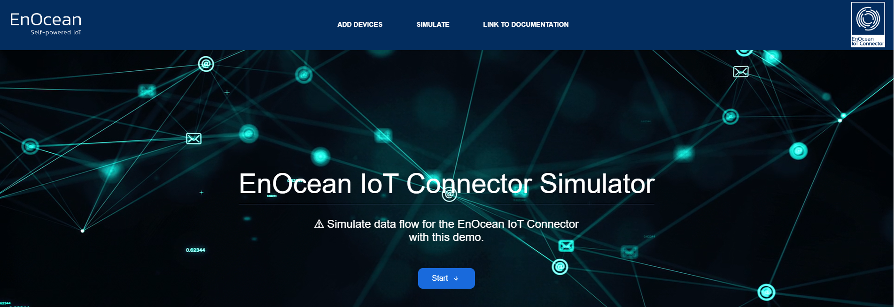
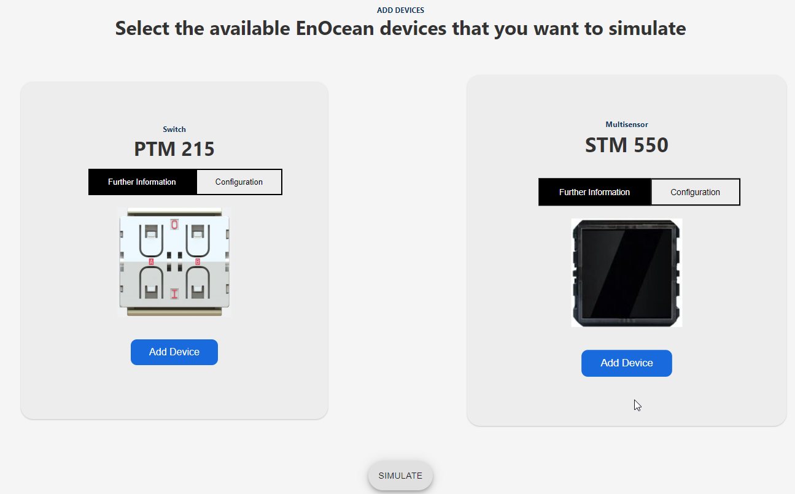
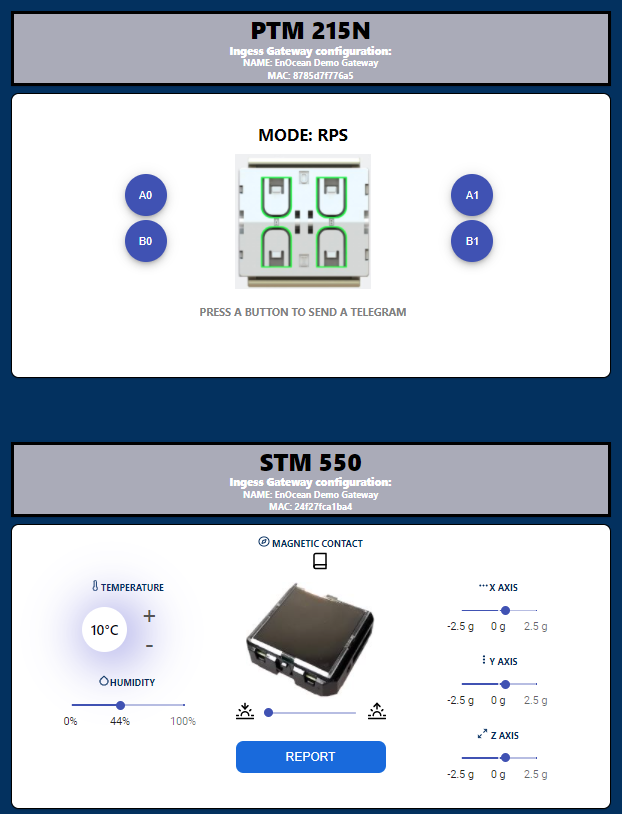

# Simulation UI

We provide a web based UI to simulate incoming traffic for the IoT Connector. This practical for:

- Test, demonstrate and use the IoT Connector features even without real EnOcean devices. e.g. test egress connectivity, simulate traffic.

- Debugging connections / deployments

The main uses cases for the simulation are:

1. Add EnOcean devices to the IoTC device list.
2. Simulate traffic from the added EnOcean devices via simulated ingress gateways.

The IoT Connector will process the simulated traffic and provide the results on the egress interface. The results are identical to a real-world scenario traffic. This EnOcean devices can be simulated:

- EnOcean [STM 550](https://www.enocean.com/en/products/enocean_modules/stm-550-multisensor-module/)

- EnOcean [PTM 215](https://www.enocean.com/en/products/enocean_modules/ptm-210ptm-215/)

The simulation UI is provide in two containers. The demo container and its backend. The demo containers are deployed separate and can be removed anytime. We do not recommend to have the containers running at real deployments. The demo containers will connect to your IoT Connector containers and simulate the traffic.

!!! warning
    The demo containers need to deployed after the IoT Connector has been already deployed. [Deploy](./deploy-the-iotc.md) the IoT Connector first. 

## Deploy  the Simulation UI

### Preparation

1. If not yet done, clone this repository `git clone https://bitbucket.org/enocean-cloud/iotconnector-docs.git` or [download](./downloads.md) the repository files. This should be downloaded to a directory in which you have edit and execute files rights.

### Deployment

The the demo containers can be theretically deplyed anywhere, given that the IoT Connector is reacheable from that location. For simplicity we recommed you deploy the demo containers in the same docker enviromenth as the IoTC.

To delopy the demo constainers follow this steps:

1. Go to the `/deploy/simulation_ui_deployment/` directory.
2. Open the `docker-compose.yml` file and add the following environment variables:

    1. IoTC Credentials
       
        Enter the credentials you have used during the [IoTC deployment](./deploy-the-iotc.md#deployment) into the `demo_api` container. Use the:
        
        - `BASIC_AUTH_USERNAME` & `BASIC_AUTH_PASSWORD` from the `proxy` container for `IOT_API_USERNAME` & `IOT_API_PASSWORD`
        
        - `IOT_GATEWAY_USERNAME` & `IOT_GATEWAY_PASSWORD` from `ingeress` container for `IOT_ENDPOINT_USERNAME` & `IOT_ENDPOINT_PASSWORD`
        
        ```yaml
            demo_api:
                image: enocean/iotconnector_demo_api


                environment:
                    - IOT_ENDPOINT_USERNAME=user1 # IoTC gateway username
                    - IOT_ENDPOINT_PASSWORD=pass# # IoTC gateway password
                    - IOT_API_USERNAME=user1 # IoTC api username
                    - IOT_API_PASSWORD=pass # IoTC api password
        ```

3. [optional] If you deploy the the demo containers into a  docker envirometnh different to the IoTC one.
You have to change also the `IOT_AUTH_URL` & `IOT_API_URL`.

    ```yaml
        demo_api:
            image: enocean/iotconnector_demo_api
            environment:
            # Use ´host.docker.internal´ when connecting to another docker container
                - IOT_AUTH_URL=https://host.docker.internal:8080/auth/aruba
                - IOT_API_URL=https://host.docker.internal/api.beta/v1/devices
    ```

    1. The `IOT_AUTH_URL` is the same as specified in the [Aruba Setup](./setup-aruba-ap.md#configure-aruba-ap-to-forward-data-to-the-iotc) as `authentificationURL` or as specified in [IoTC deployment](./deploy-the-iotc.md#deployment) for the paramter `IOT_AUTH_CALLBACK` add `https & /auth/aruba` e.g. `https://myiotconnector:8080/auth/aruba`
    2. The `IOT_API_URL` is the URL for the device API interface. The URL is `https://<hostname of the container group or IP address>/api.beta/v1/devices` e.g. `https://192.167.1.1/api.beta/v1/devices` or `https://myiotc.eastus.azurecontainer.io/api.beta/v1/devices`

4. Save the changes to the file.
5. Now deploy the containers with the `docker compose` command. For local deployments use `docker-compose up -d` for cloud deployments check the IoTC deployment steps for reference.
6. Open the demo web UI in the browser. If you have not changed the docker compose file it will be available at the URL `http://<IP address or hostname>:3000` e.g. `http://localhost:3000`
7. After you are done using the simulation we recommend to remove the demo containers by calling `docker-compose down` command.

## Use the Simulation UI
Once you deployed and opened the web UI in your browser you should the starting page. During the process of simulation you can track the behaviour for reference on the [logs](./support.md#console-log-messages) and also get data from the management [API web UI](./index.md#web-ui). The simulated traffic will be available on the specified [egress interface](./deploy-the-iotc.md#deployment) in [JSON](./index.md#end-points).

!!! note
    Reloading the web UI page will restart the simulation and all steps needs to be repeated.



To simulate device and their traffic follow these steps:

1. Click on `Add device` in the top bar or click on the `Start` button.

2. When you press on Configuration you can see the devices IoTC configuration. You can change the devices `Friendly ID` and `location`. 
    
    
3. When done press `Add Device` on one or both devices. By doing so he demo containers will try to communicate with you IoTC.
   
    You should see the infromation about this communication in the `ingress` and `engine` containers [logs](./support.md#console-log-messages).

    The added devices via the demo will be listed as onboarded devices inside the IoTC. You can check by using the [API web UI](./index.md#web-ui) and call e.g `GET backup`. The added devices should be listed there. If not check the container logs for possible error reports.

4. By scroling down or clicling on `SIMULATE` you can now triggert simulated device data reports.

    You can change the reported paramters value of the STM 550. By clicking on `REPORT`  data transmission will be simulated.
    
    By clicking on a switch nibble possition e.g. `A0` and press and release telegrams will be simulated.
    
    

    Simulated telegrams will be visible on the selected [egress interface](./deploy-the-iotc.md#deployment) in [JSON](./index.md#end-points).

    The devicess are reported by two different simulated gateways. You can see the details of the gateways below the product name. e.g. `NAME: EnOcean Demo Gateway` `MAC: 8785d7f776a5`. The gateways are known to the IoTC. You can check by using the [API web UI](./index.md#web-ui) and call e.g `GET gateways`. The used gateways should be listed there. If not check the container logs for possible error reports. The gateways will not provide any Health messages updates.
