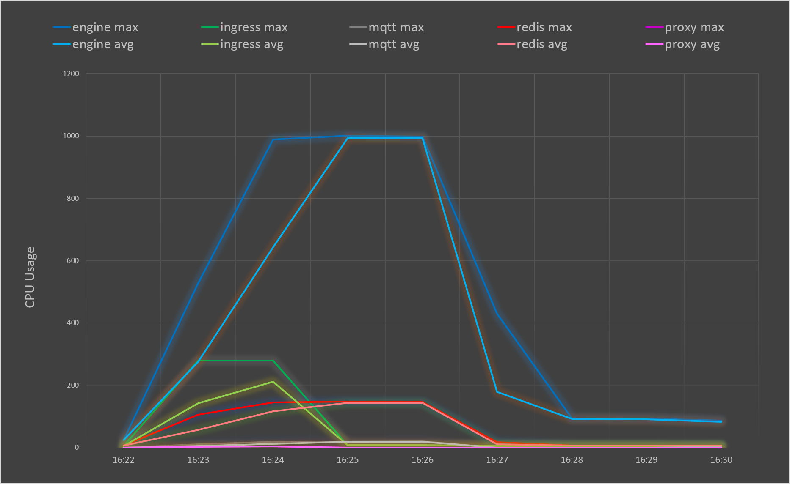

# Performance tests

## Load tests in Azure
With the typical resources specification for each container, we performed a load test at Azure Container Instances to demonstrate resources usage and prove seamless operation even in heavy load situations. The typical resource parameters are listed in `/deploy/azure_deployment/docker-compose.yml`.

### Setup

|||
|--|--|
|Nr. of total sensors| 4.000 |
|Nr. of messages per sensor | 10 |
|Nr. of total messages | 40.000 |

### Results

The egress took approx 4 minutes. All messages have been received.

CPU Usage is measured in milli-cores. One milli-core is 1/1000th of a CPU core, e.g., 500 milli-cores represent the usage of 0.5 CPU core.

### Conclusion

- Maximum performance of 10 k messages per minute with the specified resources was reached.
- If the engine gets assigned more CPU cores, performance is likely to increase linearly, but 10k messages per minute already references a very huge and busy installation, e.g., international airports with over 20 k EnOcean devices mounted.
- Total consumption in idle time and typical sized installations stays much below 1 vCPU. In high traffic times consumption was greater then 1 vCPU.
