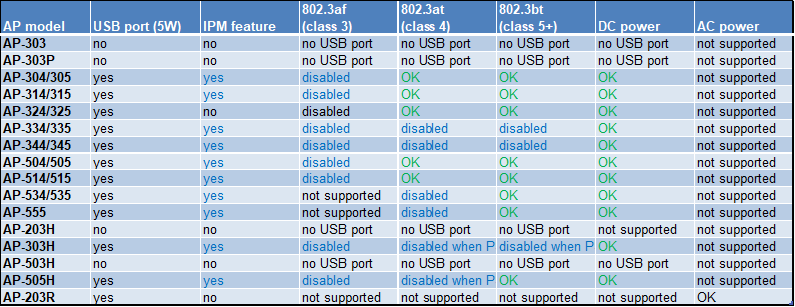

# Notes for Aruba APs

## Required Hardware and Software

+ Aruba AP: Aruba AP with USB port. 

    Check the energy requirements of our Aruba AP to properly operate the USB port. 
    

+ Aruba OS: version **8.7.0.0** or newer (most likely requires update to latest).

+ [EnOcean USB Stick](https://www.enocean.com/en/products/distributor/): USB 300, USB 300U, USB 500 or USB 500U

## Adding root certificates

By default the Aruba APs won't be able to connect to the IoT connector using a [self-signed certificate](./additional-notes.md#generating-self-signed-certificates). To fix this, it is possible to add an additional certificate by following these steps:

1. Log in into the AP's admin portal.
2. Go to the *Maintenance Section.*
3. Navigate to the *Certificates* sub-menu.
4. Click on *Upload New Certificate*.
5. Choose your root certificate, type in a name, select *Trusted CA* and click *Upload Certificate*.

## Configure Aruba AP to forward data to the IoTC

It is highly recommended to set-up the IoT Transport profile on Aruba AP through SSH. 

**Login into the AP using the same credentials from the web interface:**

```bash
$ ssh <yourUser>@<accesspointIP>
<youruser>@<accesspointIP>s password: <enter password>
```

Replace ` yourUser`, `accesspointIP` with your AP's credential's & IP-Address.

**After login:**

```bash
show tech-support and show tech-support supplemental are the two most useful outputs to collect for any kind of troubleshooting session.

aa:bb:cc:dd:ee:ff# configure terminal
We now support CLI commit model, please type "commit apply" for configuration to take effect.
aa:bb:cc:dd:ee:ff (config) # iot transportProfile myProfile
```

Replace `myProfile` with your desired profile name.

**Now configure the profile:**

=== "Aruba OS 8.8.0.0 and newer"

    ```bash
    aa:bb:cc:dd:ee:ff (IoT Transport Profile "myProfile") # endpointType telemetry-websocket
    aa:bb:cc:dd:ee:ff (IoT Transport Profile "myProfile") # endpointURL wss://myiotconnector:8080/aruba
    aa:bb:cc:dd:ee:ff (IoT Transport Profile "myProfile") # payloadContent serial-data
    aa:bb:cc:dd:ee:ff (IoT Transport Profile "myProfile") # authenticationURL https://myiotconnector:8080/auth/aruba
    aa:bb:cc:dd:ee:ff (IoT Transport Profile "myProfile") # transportInterval 30
    aa:bb:cc:dd:ee:ff (IoT Transport Profile "myProfile") # authentication-mode password
    aa:bb:cc:dd:ee:ff (IoT Transport Profile "myProfile") # username <aruba_username set using IOT_GATEWAY_USERNAME>
    aa:bb:cc:dd:ee:ff (IoT Transport Profile "myProfile") # password <aruba_password set using IOT_GATEWAY_PASSWORD>
    aa:bb:cc:dd:ee:ff (IoT Transport Profile "myProfile") # endpointID 1111
    aa:bb:cc:dd:ee:ff (IoT Transport Profile "myProfile") # end
    aa:bb:cc:dd:ee:ff# commit apply
    committing configuration...
    ```

=== "Aruba OS 8.7.0.0"

    ```bash
    aa:bb:cc:dd:ee:ff (IoT Transport Profile "myProfile") # endpointType telemetry-websocket
    aa:bb:cc:dd:ee:ff (IoT Transport Profile "myProfile") # endpointURL wss://myiotconnector:8080/aruba
    aa:bb:cc:dd:ee:ff (IoT Transport Profile "myProfile") # payloadContent serial-data
    aa:bb:cc:dd:ee:ff (IoT Transport Profile "myProfile") # authenticationURL https://myiotconnector:8080/auth/aruba
    aa:bb:cc:dd:ee:ff (IoT Transport Profile "myProfile") # transportInterval 30
    aa:bb:cc:dd:ee:ff (IoT Transport Profile "myProfile") # username <aruba_username set using IOT_GATEWAY_USERNAME>
    aa:bb:cc:dd:ee:ff (IoT Transport Profile "myProfile") # password <aruba_password set using IOT_GATEWAY_PASSWORD>
    aa:bb:cc:dd:ee:ff (IoT Transport Profile "myProfile") # end
    aa:bb:cc:dd:ee:ff# commit apply
    committing configuration...
    ```


**Then activate the profile:**

```bash
aa:bb:cc:dd:ee:ff # configure terminal
We now support CLI commit model, please type "commit apply" for configuration to take effect.
aa:bb:cc:dd:ee:ff (config) # iot useTransportProfile myProfile
aa:bb:cc:dd:ee:ff (config) # end
aa:bb:cc:dd:ee:ff # commit apply
committing configuration...
configuration committed.
```

## Debugging & Troubleshooting

In case the Aruba AP (instant) is not connected to the IoTC i.e. the device is not listed in the gateway list or no EnOcean telegrams are visible on the egress of the IoTC. Try the following steps. Please consider that the commands syntax might change with new Aruba OS releases. The commands were tested with Aruba OS 8.8.x.

1. Show the IoT configuration. Get show and confirm the showed information correspond with the inputs provided before.

    ```powershell
    aa:bb:cc:dd:ee:ff # show iot transportProfile myProfile
    ```

2. Show & check connected USB devices. Example output is attached. For proper communication an `EnOcean USB` device must be connected to the AP.

    ```powershell
    aa:bb:cc:dd:ee:ff # show usb devices

    USB Device Info
    ---------------
    DeviceID  APMac Vendor ID  Product ID  Manufacturer  Product             Version  Serial    Class  Device   Driver    Uptime
    --------  ---------------  ----------  ------------  -------             -------  -------   -----  ------   ------    ------
    d3adas..  aa:.. 0403       6001        EnOcean GmbH  EnOcean USB 300 DC  2.00     FT55W4A9  tty    ttyUSB0  ftdi_sio  24m34s
    ```

3. Check the configured IoT Configuration status. `...` represents omitted information.

    ```powershell
    aa:bb:cc:dd:ee:ff # show ap debug ble-relay iot-profile
    
    ConfigID                                : xx
    
    ---------------------------Profile[myProfile]---------------------------
    
    authenticationURL                       : ...
    serverURL                               : ...
    ...
    --------------------------
    TransportContext                        : Connection Established
    Last Data Update                        : 2021-06-14 15:01:20
    Last Send Time                          : 2021-06-14 15:01:19
    TransType                               : Websocket
    ```

    If `TransportContext` displays an error message, please follow up on the meaning of the message. Please consider it can take few seconds to build the connection.

4. To check if EnOcean telegrams are being received and forwarded via the established connection please use the following command and watch if the `Websocket Write Stats` increases after a known EnOcean telegram transmission. Also check for changes in `Last Send Time`. `...` represents omitted information.

    ```powershell
    aa:bb:cc:dd:ee:ff # show ap debug ble-relay report

    ---------------------------Profile[myProfile]---------------------------

    WebSocket Connect Status                : Connection Established
    WebSocket Connection Established        : Yes
    Handshake Address                       : ...
    Refresh Token                           : Not Configured
    Access Token                            : ...
    Access Token Request by Client at       : 2021-06-14 14:18:32
    Access Token Expire at                  : 2021-06-14 15:18:32
    Location Id                             : ...
    Websocket Address                       : ...
    WebSocket Host                          : ...
    WebSocket Path                          : ...
    Vlan Interface                          : Not Configured
    Current WebSocket Started at            : 2021-06-14 14:18:42
    Web Proxy                               : NA
    Proxy Username&password                 : NA, NA
    Last Send Time                          : 2021-06-14 14:30:35
    Websocket Write Stats                   : 8278 (1454156B)
    Websocket Write WM                      : 0B (0)
    Websocket Read Stats                    : 0 (0B)
    ```

5. If there are any issues you can get additional log messages by running the following command.

    ```powershell
    aa:bb:cc:dd:ee:ff #  show ap debug ble-relay ws-log myProfile
    ```

    If you struggle with the connection of an Instant Aruba AP please contact the Aruba technical support.

    For debugging enterprise connected Aruba AP, via an [Aruba Controller](https://www.arubanetworks.com/en-gb/products/wireless/gateways-and-controllers/) please use these commands instead.

    ```powershell
    #Show profiles
    show iot transportProfile myProfile
    
    #Show USB devices
    show ap usb-device-mgmt all
    
    #Show status and report 
    show ble_relay iot-profile
    show ble_relay report <iot-profile-name>
    
    #Show Log
    show ble_relay ws-log <iot-profile-name>
    ```
